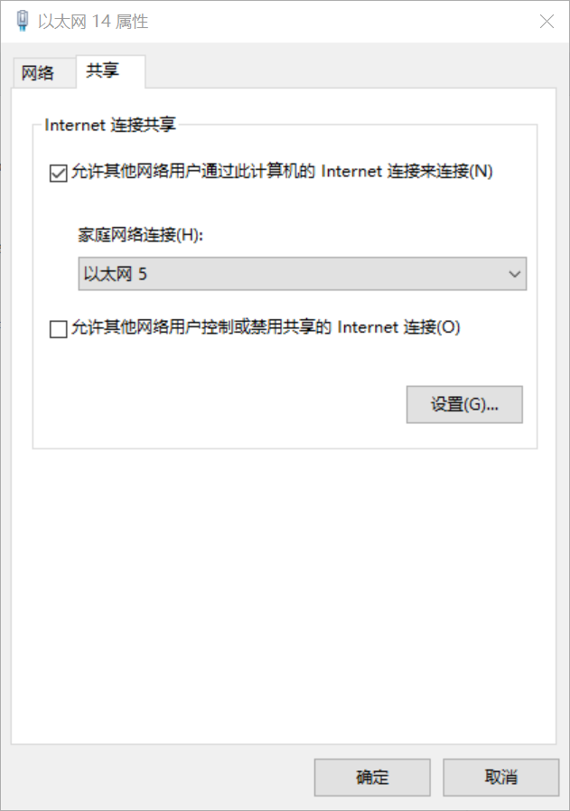
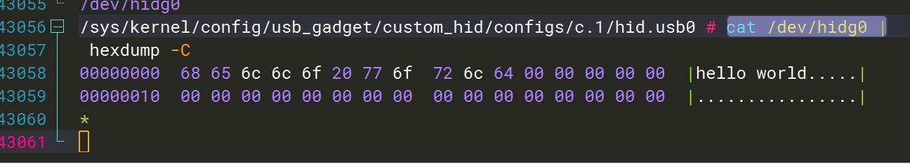

## 编译

 如果需要板子作为usb device提供uvc功能，则需以下编译步骤，否则无需编译。只需把scripts目录下的脚本拷贝到板子上，运行脚本配置相应功能即可。

导出交叉工具链到环境变量，或者在Bianbu desktop上执行

```
$ make
#产出uvc-gadget-new
```

## 配置脚本
本仓库提供两个 usb gadget 配置脚本，分别是：
1. 用于配置 uvc gadget 的 scripts/uvc-gadget-setup.sh
2. 用于配置 adb、rndis、uvc、mass storage 的 scripts/gadget-setup.sh

具体使用方法可以查看对应脚本 help 命令及参考本文档的后续章节。

查看脚本使用帮助：
```
uvc-gadget-setup.sh help
gadget-setup.sh help
```

更多内容参阅内核官方测试文档: [Gadget Testing | kernel.org](https://www.kernel.org/doc/html/latest/usb/gadget-testing.html)


## UVC
板子做usb device，UVC配置可选用两种方法：

1. 使用专用uvc脚本，支持更多uvc配置，独立USB PID（推荐）：
```
$ /etc/init.d/S50adb-setup stop
$ uvc-gadget-setup.sh start
$ uvc-gadget-new
```

2. 使用composite gadget脚本，支持uvc与其他功能同时使用。
```
$ /etc/init.d/S50adb-setup stop
$ gadget-setup.sh uvc
$ uvc-gadget-new
```


## RNDIS

```
gadget-setup.sh rndis
```

另外最新脚本增加快捷运行 dhcp 服务器功能，依赖 busybox udhcpd，只需要执行

```
gadget-setup.sh dhcp
```

就会自动为网卡配置ip地址，并且支持给PC通过DHCP协议分配IP地址，具体请查看脚本实现。

### PC共享互联网给开发板
本节内容为，对于无直接网络环境只有RNDIS USB Gadget连接的开发板，
把Windows访问互联网的能力共享给开发板，使得开发板访问互联网。

1. 执行命令：
    ```bash
    gadget-setup rndis
    ```
2. 打开Windows网络与共享中心
3. 打开共享网络配置选择一个连接了外网的网络，如WIFI、有线网络
4. 右键点击属性，
5. 点击共享，然后勾选允许其他网络用户通过此计算机的Internet连接来连接。
6. 在选择家庭网络连接列表中选择为你的RNDIS设备（图中以太网5是你的USB开发板RNDIS设备,以太网14是你的WIFI/有线网）：

7. 点击确定。
8. 开发板执行 udhcpc -i usb0 获取Windows为其分配的IP地址。

Windows还可以基于网桥，请参考相关Windows官方手册。

对于Linux PC，各图形界面不一致这里不介绍，但是网络配置非常灵活，可参考Linux相关网络命令工具配置教程。


### PC端驱动配置

目前最新版脚本**已经支持**Linux、Windows10下自动识别RNDIS设备驱动，**一般无需手动安装**。  
如果你要二次开发脚本等其他需求时需要手动安装驱动，请参考下图：


## NCM

不同于RNDIS由微软维护，NCM是USB-IF维护网络协议，主流操作系统（Linux,Windows 11,macOS等）具备支持。
注：目前Windows 10的ncm驱动实现和Linux 6.6中ncm gadget兼容性不是最佳，微软在Windows 11才进行修复。
```
gadget-setup.sh ncm
```

另外最新脚本增加快捷运行 dhcp 服务器功能，依赖 busybox udhcpd，只需要执行

```
gadget-setup.sh dhcp
```

就会自动为网卡配置ip地址，并且支持给PC通过DHCP协议分配IP地址，具体请查看脚本实现。

对于需要使开发板共享Windows的，参考RNDIS章节的 "Windows共享互联网给开发板" 内容，但是第一步命令要改成 ncm 而不是 rndis。

## ADB
gadget-setup.sh 通用脚本集成了 ADB功能。

注：Bianbu desktop/linux有默认集成adb功能，gadget-setup.sh不能和系统集成的同时使用。
```
# 配置 adb
gadget-setup.sh adb
# 停止 adb
gadget-setup.sh stop
```

## Mass Storage （BOT协议）

先安装`sudo apt install dosfstools`

```
gadget-setup.sh msc:<镜像或设备节点>
# 举例
gadget-setup.sh msc:/dev/nvme0n1

#使用内存盘
gadget-setup.sh msc
```

## Mass Storage （支持UASP协议）

先安装`sudo apt install dosfstools`

UASP协议提升了传输效率。
```
gadget-setup.sh uas:<镜像或设备节点>
# 举例
gadget-setup.sh uas:/dev/nvme0n1

#使用内存盘
gadget-setup.sh uas
```

## ACM
ACM 是串口。使用也非常简单，运行gadget脚本拉起串口gadget后，gadget board这边的Linux中会

```bash
gadget-setup.sh acm
```

在/dev下生成 ttyGS* 块设备节点，通常是 /dev/ttyGS0。

随后连接到PC等上位机后，就可以正常的串口通信，你把数据写入 /dev/ttyGS0，PC就能从中读到数据。

## HID
HID 是人体工学设备，通常用于模拟键盘鼠标。

```bash
gadget-setup.sh hid
```

需要注意 report 格式，在脚本中的REPORT_DESC定义，你可以通过全局搜索找到他，并且做修改。

具体的report格式配置需要熟读HID协议，更多详细内容可以参考相关的内核文档、规范文档。

**模拟键盘鼠标**场景的细节可以参考[这个内核文档](https://www.kernel.org/doc/html/latest/usb/gadget_hid.html)。

除此之外最简单是测试IO方法可以使用python和cat/hexdump工具（不完整处理和解析HID report格式）：

1. 开发板linux系统下执行收文件命令，是打开open一个字符节点read，举例，用cat不断读取：
```
cat /dev/hidg0 | hexdump -C
```

3. Windows PC 采用python免驱发送helloworld：python先安装依赖

```bash
pip install hidapi  # Windows/Linux通用
```

4. PC 使用python通过HID协议向设备发送hello world：
```python
import hid

"""
注意这段代码是在PC运行的
"""
# 查找自定义 HID 设备
device = hid.device()

# 根据厂商ID和产品ID打开设备
vendor_id = 0x361c  # SpacemiT
product_id = 0x0007  # 产品ID
device.open(vendor_id, product_id)

# 设置非阻塞模式（可选）
device.set_nonblocking(1)

# 准备数据（开头需要添加报告ID，通常为0x00）
message = b"\x00" + b"hello world".ljust(63, b"\x00")  # 总长度64字节

# 发送数据
device.write(message)
print("已发送: hello world")

# 接收响应（如果有）
data = device.read(64)
if data:
    print(f"收到响应: {bytes(data[1:]).decode('ascii').strip()}")  # 跳过报告ID

# 关闭设备
device.close()
```

PC脚本执行后，实测图片截图如下(gadget端):


## 复合设备
举例：rndis + adb：
```
gadget-setup.sh rndis,adb
```

## 手动选择控制器
由于当前硬件平台可能有多个支持device的usb控制器（udc），可以用以下命令查看可用的 udc：
```
~ # gadget-setup info
SpacemiT gadget-setup tool v0.5-SUPPORTROLESW

Board Model: spacemit k1-x MUSE-Pi board
# ....
Available UDCs: c0900100.udc c0980100.udc1 c0a00000.dwc3
# ...

# 或者直接适用：
~ # ls /sys/class/udc/
c0900100.udc   c0980100.udc1  c0a00000.dwc3
```

默认脚本选用 /sys/class/udc/ 目录下的第一个 udc。

用户可以通过环境变量指定特定 udc，举例：

```
# 选择第二个 udc
USB_UDC_IDX=2 gadget-setup.sh ...
USB_UDC_IDX=2 uvc-gadget-setup.sh ...
# 选择 c0a00000.dwc3
USB_UDC=c0a00000.dwc3 gadget-setup.sh ...
USB_UDC=c0a00000.dwc3 uvc-gadget-setup.sh ...
```
其中 ... 省略了脚本的其他参数。

## 手动切换控制器角色
在usb控制器支持手动切换的方案中，可以通过以下命令来查看支持切换的控制器：
```
gadget-setup.sh info

Board Model: spacemit k1-x MUSE-Pi board
# ....
Available DRDs: mv-otg1-role-switch c0a00000.dwc3
# ...

```
对于支持切换的控制器对应到方案开发板的接口关系（如mv-otg-role-switch对应k1烧录口），请参考USB开发文档相关章节。

通过以下命令来切换控制器角色 host 或 device：
```
gadget-setup.sh role <控制器/otg名称> <device或者host>
# 举例：
gadget-setup.sh role c0a00000.dwc3 device
```
注：切换至device模式时如果对应USB接口存在额外的vbus配置，需要手动关闭，见具体方案文档。
