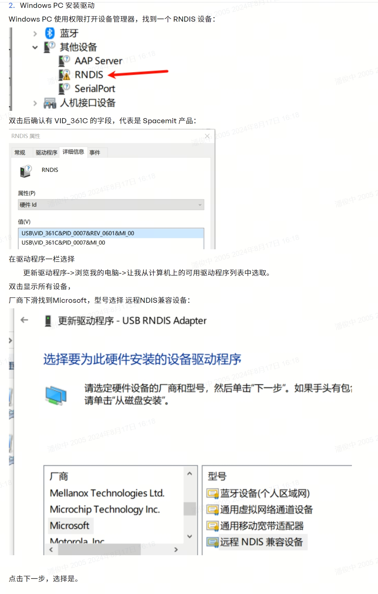

## 编译

导出交叉工具链到环境变量

```
$ make
//copy scripts/gadget-setup.sh and uvc-gadget-new to k1 board
```


## UVC

```
$ /etc/init.d/S50adb-setup stop
$ gadget-setup.sh uvc
$ uvc-gadget-new
```

注:  如果出不了图了需要重新启动uvc-gadget-new


## RNDIS

```
gadget-setup.sh rndis
```

### PC端设置



